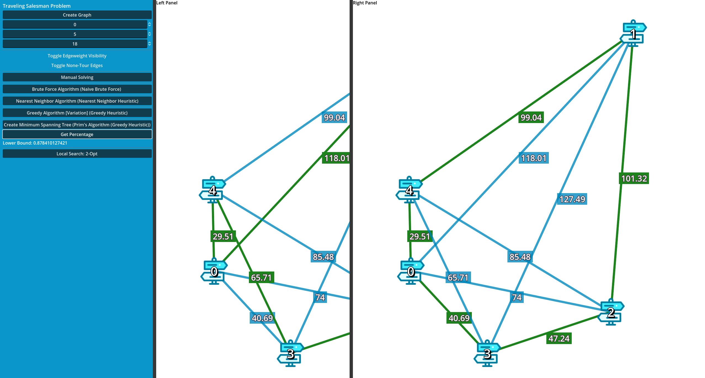
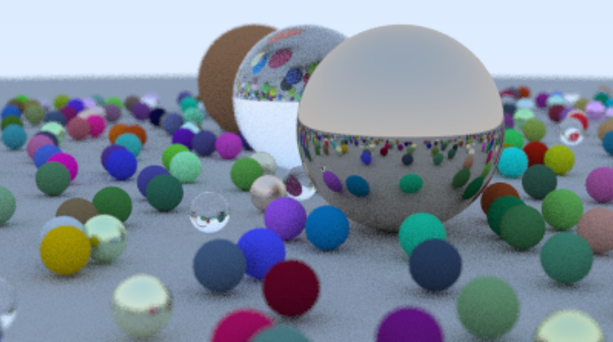

# Cuppixx.github.io - Portfolio
__My personal blog and portfolio__. Last Updated on: December 28th 2024.

**Disclaimer:**  
  This content might be outdated!  
  The README content has been moved to and will now be displayed on the index.hmtl.  
  Refer to [cuppixx.github.io](https://cuppixx.github.io).

- __Name:__ David (Alias: Cuppixx)
- __Bio:__
  - Hobbyist game developer and IT/software student
  - Working on my bachelor's thesis
- __Contact Information:__ _cuppixd@gmx.de_
- __Location:__ Germany

## Table of contents
1. [Introduction](#introduction)
2. [**Projects**](#projects)
3. [**Gists**](#gists)
4. [About Me](#about_me)
5. [Appendix](#appendix)

## Table of projects
1. [KoalaTime_Take-A-Break](#koala_time)
2. [KoalaTime_Take-A-Break - Advanced](#panda_time)
3. [**RidiculousCodingCuppixxVersion**](#ridiculous_coding)
4. [WinBgSwitcher](#win_bg_switcher)
5. [**Traveling Salesman Problem**](#tsp_class_project)
6. [RayTracingInOneWeekend](#raytracing_weekend)

## Table of gists
1. [sequential_renamer.bat](#sequential_renamer)
2. [file_sorter.bat](#file_sorter)

---

## Introduction and Overview
Hi, I'm Cuppixx, a passionate hobbyist game developer and IT/software student with a focus on computer graphics, game design, development, and software engineering. 

My expertise spans across multiple languages, including  GDScript, Rust, C#, C++, C, Java, Python, SQL, HTML, JavaScript, and more. I have hands-on experience with game engines such as Godot, Unreal, Unity, and Bevy.
I also have foundational knowledge in the fields of networking, internet applications, distributed systems, and IT security.

I love turning ideas into interactive, polished experiences and enjoy working on projects that challenge my creativity and problem-solving skills.

[**... continue reading.**](#about_me)

# Projects
Below is a list of projects I have worked on, either independently or as part of a team. These projects include assets, games, software, and templates.
The projects are not listed in any particular order.

**A note on project dates:** 

Project dates are intended to show how long I worked on the core of an individual project, supported it, or continued to push new updates and features. This means that project dates don’t always reflect the actual commit history. Therefore, if you're interested in seeing exactly how much work I put into each project, please refer to their individual commit history.
 
[//]: # (////////////////////////////////////////////////////////////////////////////////////////////////////////////////////////////////////////////////////////////////////////////////////////////////////////////////////////////////////////////////////////////////////////////////////////////////)
[//]: # (////////////////////////////////////////////////////////////////////////////////////////////////////////////////////////////////////////////////////////////////////////////////////////////////////////////////////////////////////////////////////////////////////////////////////////////////)

## Project: KoalaTime_Take-A-Break
**Project Type:** _Personal, Professional_

**Project Category:** _Engine Asset_

**Role:** _Solo developer_

**Date:** _March 14th 2024 - May 19th 2024_

**Technologies Used:**  `Godot Engine`, `GDScript`

##### Overview

_KoalaTime is an asset I originally developed for personal use and later published to the Godot Asset Store. The asset allows users to set up a work/break timer that reminds them to take a break after a specified period. My goal was to improve my workflow by incorporating small breaks to recharge during work sessions. The project was purposefully kept minimalistic to maintain simplicity and a visually clean design. The asset includes sounds, images, and a few customization options, such as displaying your own images during break time._

##### Key Contributions

- _Solo development._

##### Challenges & Solutions

- _None._

The project itself wasn't what I would consider difficult; there were no challenges that caused me to get stuck during development. However, a few notable features, while not challenging, were interesting to implement. One of these was a recursive algorithm that searches through the project’s file structure to collect any images the user has provided, allowing for a highly flexible file structure. No matter how complex or nested, it will return every image.

##### Results & Impact

- _As of October 2024, the project has received a total of 3 stars on GitHub._
- _Throughout its development the project has had over 300 unique visitors, according to GitHub's traffic tool._
- _After the last commit, the project had an averaged 1 to 2 unique visitors every two weeks, again based on data from GitHub's traffic tool._
- _Feedback from various Twitch users in the Software and Game Development category has been positive. They noted that the plugin looks visually clean and professional. The overall concept was well received, and several streamers mentioned they enjoy using it._

##### Links

- [Project Repository](https://github.com/Cuppixx/KoalaTime_Take-A-Break)
- [Godot Asset Store](https://godotengine.org/asset-library/asset?user=CuppiXD)
  
---
---

[//]: # (////////////////////////////////////////////////////////////////////////////////////////////////////////////////////////////////////////////////////////////////////////////////////////////////////////////////////////////////////////////////////////////////////////////////////////////////)
[//]: # (////////////////////////////////////////////////////////////////////////////////////////////////////////////////////////////////////////////////////////////////////////////////////////////////////////////////////////////////////////////////////////////////////////////////////////////////)

## Project: PandaTime_Take-A-Break
**Project Type:** _Personal, Professional_

**Project Category:** _Engine Asset_

**Role:** _Solo developer_

**Date:** _March 14th 2024 - August 4th 2024_

**Technologies Used:**  `Godot Engine`, `GDScript`

##### Overview

_PandaTime is an asset I originally developed for personal use and later published to the Godot Asset Store. The asset allows users to set up a work/break timer that reminds them to take a break after a specified period. My goal was to improve my workflow by incorporating small breaks to recharge during work sessions. The project was designed with a visually clean design in mind and features a dedicated settings window. The asset includes sounds, images, and a lot of customization options._

_The asset is a more feature and settings heavy version of the above KoalaTime._

##### Key Contributions

- _Solo development._

##### Challenges & Solutions

- _Communication between various isolated, separate window instances._
  - _Solved by setting up a signal connection during instantiation, before adding the instance to the scene tree. I also connected to the window's internal signals from the outside to obtain information about the window state, using those informations to exchange data before a node is freed from the scene tree._

##### Results & Impact

- _As of October 2024, the project has no stars on GitHub._
- _Throughout its development the project has had over 150 unique visitors, according to GitHub's traffic tool._
- _After the last commit, the project had an averaged 0 to 1 unique visitors every two weeks, again based on data from GitHub's traffic tool._
- _Feedback from 2 Twitch users in the Software and Game Development category has been positive. They noted that the plugin looks visually clean and professional. The overall concept was well received._
- _Users were pleased with the extensive customization options available and had no further requests for feature implementations._

##### Links

- [Project Repository](https://github.com/Cuppixx/PandaTime_Take-A-Break)
- [Godot Asset Store](https://godotengine.org/asset-library/asset?user=CuppiXD)
  
---
---

[//]: # (////////////////////////////////////////////////////////////////////////////////////////////////////////////////////////////////////////////////////////////////////////////////////////////////////////////////////////////////////////////////////////////////////////////////////////////////)
[//]: # (////////////////////////////////////////////////////////////////////////////////////////////////////////////////////////////////////////////////////////////////////////////////////////////////////////////////////////////////////////////////////////////////////////////////////////////////)

## Project: RidiculousCodingCuppixxVersion
**Project Type:** _Personal, Professional_

**Project Category:** _Engine Asset_

**Role:** _Solo developer_

**Date:** _February 26th 2024 - October 5th 2024_

**Technologies Used:**  `Godot Engine`, `GDScript`

##### Overview

_Ridiculous Coding is an asset I forked to expand upon. It adds flashy and ridiculous visual effects, as well as an XP system, to the Godot engine. The asset is designed to make the coding process more engaging and fun, offering numerous customization options to allow users to adjust the level of ridiculousness to suit their preferences._

##### Key Contributions

- _Solo development on my fork._
- _I fixed a few known issues, such as the state of buttons not being loaded on startup._
- _I developed and added an extensive settings menu._
- _I added new features and settings based on user requests._

Overall, all my contributions were aimed at transforming the asset into my own version, allowing as many users as possible to use the addon and toggle various settings to tailor the plugin to their preferences. Feedback on the original plugin indicated that some users were reluctant to use it due to specific settings, implementations, visuals, or sounds they didn't like. As a result, I reworked and recreated the asset. 

This project was also my very first Godot asset. but thanks to the documentation and a quick understanding of how Godot assets work, it provided an easy and smooth introduction to Godot's asset development.

##### Challenges & Solutions

- _Working on an existing asset, I had to work through a lot of the pre-written code and logic to understand the structure of the original project._
- _During development, an issue was reported where the settings window was being cut off._
   - _After some research, we could confirm that the issue was caused by the engine itself. As a result, the issue wasn't pursued further._

##### Results & Impact

- _As of October 2024, the project has 13 stars, making it the most popular fork of the original asset._
- _Throughout its development the project has had over **2000 unique visitors**, according to GitHub's traffic tool._
- _After the last commit, the project had an averaged of 10 unique visitors every two weeks, again based on data from GitHub's traffic tool._
- _Feedback from various Twitch users in the Software and Game Development category has been positive._
  - _Users noted that the plugin looks visually clean and professional._
  - _Users were pleased with the extensive customization options available and, after some dialogue, recommended features they would love to see in the asset. Many of these features were later implemented, and the additions were well received and appreciated._
  
##### Links

- [Project Repository](https://github.com/Cuppixx/RidiculousCodingCuppixxVersion)
- [Godot Asset Store](https://godotengine.org/asset-library/asset?user=CuppiXD)
  
---
---

[//]: # (////////////////////////////////////////////////////////////////////////////////////////////////////////////////////////////////////////////////////////////////////////////////////////////////////////////////////////////////////////////////////////////////////////////////////////////////)
[//]: # (////////////////////////////////////////////////////////////////////////////////////////////////////////////////////////////////////////////////////////////////////////////////////////////////////////////////////////////////////////////////////////////////////////////////////////////////)

## Project: WinBgSwitcher
**Project Type:** _Personal, Professional_

**Project Category:** _Software_

**Role:** _Solo developer_

**Date:** _October 9th 2024 - October 13th 2024_

**Technologies Used:**  `VSCode`, `Python`, `PyInstaller`

##### Overview

_The WindowsBackgroundSwitcher is a small program I designed in a few hours time to run in the background of my PC. It allows for users to switch the desktop background image with the press of a keybind. It uses two folders to swap between images and can run on startup for ease of use.
The executable works with a config.ini file, which allows you to set the two folders and customize the keybinds to your liking._

_I designed the application to quickly swap my desktop images for ones I don’t mind sharing during screen shares on Discord, Zoom, or some other tools for my studies._

##### Key Contributions

- _Solo development._

##### Challenges & Solutions

- _Communication between the Python application and the Windows operating system._
  - _Since this was my first time writing an application focused on communication with the operating system, I chose Python for this project because its packages facilitate smooth interaction with the OS._
- _The executable, built using PyInstaller, frequently gets flagged as malware or a trojan by Windows Defender._
  
##### Results & Impact

- _After the last commit, the project had an averaged 0 to 1 unique visitors every two weeks, based on data from GitHub's traffic tool._
- _Because the executable raises false positives the project required additional effort to document the software's legitimacy, communicate its safety to users, and explore ways to minimize false positives during the compilation and distribution process._

##### Links

- [Project Repository](https://github.com/Cuppixx/WinBgSwitcher)
- [Itch.io](https://cuppixx.itch.io/win-bg-switcher)
  
---
---

[//]: # (////////////////////////////////////////////////////////////////////////////////////////////////////////////////////////////////////////////////////////////////////////////////////////////////////////////////////////////////////////////////////////////////////////////////////////////////)
[//]: # (////////////////////////////////////////////////////////////////////////////////////////////////////////////////////////////////////////////////////////////////////////////////////////////////////////////////////////////////////////////////////////////////////////////////////////////////)

## Project: Traveling Salesman Problem
**Project Type:** _Academic_

**Project Category:** _Paper, Software_

**Role:** _Solo developer_

**Date:**
- TravelingSalesmanProblem_AcademicPaper:&ensp;_April 19th 2024 - June 28th 2024_
- TravelingSalesmanProblem_ClassProject:&ensp;_April 10th 2024 - October 28th 2024_
- TravelingSalesmanProblem_ClassProject_PythonImplementation:&ensp;_May 5th 2024 - June 30th 2024_

**Technologies Used:**  `VSCode`, `TeX Live`, `Godot Engine`, `GDScript`, `Python`, `Matplotlib`, `Scipy`

##### Overview

_The TSP Project is a combination of three individual projects I worked on for two different classes during my 4th semester. The academic paper and class project were part of my Algorithms and Data Structures class, whereas the Python implementation of the class project was created for my Practical Optimizations class._

_The class project was written in GDScript and aimed to visually compare the different results produced by various algorithms and heuristics for solving the TSP. The Python implementation, on the other hand, focused more on optimizing the algorithms and measuring and evaluating the data sets collected from these approaches._

##### _TravelingSalesmanProblem_ClassProject:_

##### Key Contributions

- _Solo development._

##### Challenges & Solutions

- _Implementing the algorithms from scratch in Godot._
- _Understanding heursistics._

By far, the biggest challenge for me with this project was that the algorithms aren’t "perfect". My coding knowledge was, and still is, limited. I’m still learning yet already want to achieve a "perfect" result. For me, perfection doesn’t mean the best performance or code quality; it means looking at the code and feeling a sense of completion. I’m not sure how else to put it, but I certainly wasted one too many hours staring at my code, feeling like something was off, even though the performance was good, it produced decent results, and my professor praised it. 

Maybe _it is_ the code quality that does bother me in the end, but I just can’t pinpoint it. So, wrapping up three projects that I don’t feel are truly finished left me feeling bad and frustrated.

##### Results & Impact

- _The evolutionary algorithm I implemented for my Practical Optimizations class achieved the second-best time in our class and was one of only two solutions that successfully found the shortest route for the berlin52.tsp problem._
- _I scored extremely well in both classes, achieving the highest score in one of them._

##### Links

- [Private Project Repository TravelingSalesmanProblem_AcademicPaper](https://github.com/Cuppixx/TravelingSalesmanProblem_AcademicPaper) and [Public Paper](https://cuppixx.github.io/TSP.github.io/)
- [Project Repository TravelingSalesmanProblem_ClassProject](https://github.com/Cuppixx/TravelingSalesmanProblem_ClassProject)
- [Project Repository TravelingSalesmanProblem_ClassProject_PythonImplementation](https://github.com/Cuppixx/TravelingSalesmanProblem_ClassProject_PythonImplementation)
  
---
---

[//]: # (////////////////////////////////////////////////////////////////////////////////////////////////////////////////////////////////////////////////////////////////////////////////////////////////////////////////////////////////////////////////////////////////////////////////////////////////)
[//]: # (////////////////////////////////////////////////////////////////////////////////////////////////////////////////////////////////////////////////////////////////////////////////////////////////////////////////////////////////////////////////////////////////////////////////////////////////)

## Project: RayTracingInOneWeekend
**Project Type:** _Personal, Self-Educational_

**Project Category:** _Computer Graphics_

**Role:** _Solo developer_

**Date:** _November 30th 2024 - December 1st 2024_

**Technologies Used:**  `VSCode`, `C`, `CXX`, `Cmake`

##### Overview

_This project followed the book (tutorial) ["Ray Tracing In One Weekend"](https://raytracing.github.io/books/RayTracingInOneWeekend.html#overview) by Peter Shirley, Trevor David Black, Steve Hollasch. It served as a dedicated learning experience to deepen my knowledge and understanding of fundamental ray tracing concepts by implementing a basic ray tracer._

##### Key Contributions

- _None, just followed the tutorial._

##### Challenges & Solutions

- _One of the biggest challenges I faced was the mathematical aspect of the ray tracer. Math has never been my strongest subject, and I doubt it ever will be. Ensuring I fully understood the underlying concepts for vector and dimensional calculations was particularly difficult. While I grasped the material during my read of the book, I’m not confident I could explain it in detail days later._

##### Results & Impact

- _As a self-educational project, the primary outcomes and impact were focused on personal learning and skill development._
- _Restating the key aspects I gained from this project, they include:_
  - _Ray Casting Basics._
  - _Ray-Sphere Intersection._
  - _Shading and Lighting._
  - _Antialiasing._
  - _Materials and Reflection._
  - _Recursive Ray Tracing._

##### Links

- [Project Repository](https://github.com/Cuppixx/RayTracingInOneWeekend)
- [Original Repository](https://github.com/RayTracing/raytracing.github.io)
  
---
---

[//]: # (////////////////////////////////////////////////////////////////////////////////////////////////////////////////////////////////////////////////////////////////////////////////////////////////////////////////////////////////////////////////////////////////////////////////////////////////)
[//]: # (////////////////////////////////////////////////////////////////////////////////////////////////////////////////////////////////////////////////////////////////////////////////////////////////////////////////////////////////////////////////////////////////////////////////////////////////)

# Gists

Unlike the full-fledged projects from before, the Gists section features quick code snippets and (mainly) small utilities in form of 

- scripts (.bat, .sh, .py, .rb),
- config files (.json, .yaml, .xml),
- web development files (.html, .css, .js),
- or anything else that might fit into a single file.

All available through my [GitHub Gists](https://gist.github.com/Cuppixx).

Being contained in a single file doesn’t mean, however, that these small, single-file applications and snippets are any less interesting or caused me any less frustration while creating them.

[//]: # (////////////////////////////////////////////////////////////////////////////////////////////////////////////////////////////////////////////////////////////////////////////////////////////////////////////////////////////////////////////////////////////////////////////////////////////////)
[//]: # (////////////////////////////////////////////////////////////////////////////////////////////////////////////////////////////////////////////////////////////////////////////////////////////////////////////////////////////////////////////////////////////////////////////////////////////////)

## Gist: sequential_renamer.bat
**Category:** _Windows Command Line Tool_

**Date:** _November 16th 2024_

**Technologies Used:**  `VSCode`, `Batch`, `Windows File System API`

##### Overview

_The sequential_renamer is a single batch (.bat) file that, when executed from the command line, takes a folder path and a base name as arguments and recursively renames image files (png, jpg, jpeg) in the specified folder and its subfolders to a sequential naming convention,
using a provided base name and a 3-digit numbering system (e.g. base_name_000.png, base_name_001.jpg, etc.)._

##### Challenges & Solutions

- _First time working with and writing a batch file._
 

Not a challenge, but rather a **lesson** I learned while testing this file: 

**It’s crucial to ensure your script is type-safe and includes safeguards, especially when working with files in the Windows filesystem.**

What happend was that, while testing the batch file, I was copy- and pasting a file path into the command prompt, which was "so far so good". 
Now somehow (and I still don’t know how), I managed to unleash the batch file on my entire D: drive. At that point, I hadn’t implemented a file type check for PNG, JPG, or JPEG files nor did I had any promts in place wether I truly want to process a given folder.

In a panic, I watched as the output flooded with reports of successfully renamed Godot files from my godot_demo folder. Thankfully, I was able to terminate the script before it could reach any of my study files, personal projects, or wreak havoc on my other folders.
I shudder to think of the damage that could’ve occurred if I had accidentally targeted the C: instead of the D: drive.

**Lesson learned:**

This experience definitely taught me that simply being careful isn’t enough to prevent unwanted damage when working with something so crucial as the operating system. 
Having measures in place to verify inputs and restrict operations early on is critical, especially when dealing with sensitive files in your Windows filesystem.

##### Links

- [Gist Page](https://gist.github.com/Cuppixx/5c4b4bca0cdd31ba457480c27727e7db)
  
---
---

[//]: # (////////////////////////////////////////////////////////////////////////////////////////////////////////////////////////////////////////////////////////////////////////////////////////////////////////////////////////////////////////////////////////////////////////////////////////////////)
[//]: # (////////////////////////////////////////////////////////////////////////////////////////////////////////////////////////////////////////////////////////////////////////////////////////////////////////////////////////////////////////////////////////////////////////////////////////////////)

## Gist: file_sorter.bat
**Category:** _Windows Command Line Tool_

**Date:** _November 24th 2024_

**Technologies Used:**  `VSCode`, `Batch`, `Windows File System API`

##### Overview

_A batch script to sort files in a specified folder into subfolders based on their extensions and optionally clean up empty folders._

##### Challenges & Solutions

- _None._

##### Links

- [Gist Page](https://gist.github.com/Cuppixx/b7b2fe74869324933d3419952afdd570)

---
---

[//]: # (////////////////////////////////////////////////////////////////////////////////////////////////////////////////////////////////////////////////////////////////////////////////////////////////////////////////////////////////////////////////////////////////////////////////////////////////)
[//]: # (////////////////////////////////////////////////////////////////////////////////////////////////////////////////////////////////////////////////////////////////////////////////////////////////////////////////////////////////////////////////////////////////////////////////////////////////)

# About Me

_... and a bit of this and that._

## 

[//]: # (////////////////////////////////////////////////////////////////////////////////////////////////////////////////////////////////////////////////////////////////////////////////////////////////////////////////////////////////////////////////////////////////////////////////////////////////)
[//]: # (////////////////////////////////////////////////////////////////////////////////////////////////////////////////////////////////////////////////////////////////////////////////////////////////////////////////////////////////////////////////////////////////////////////////////////////////)

# Appendix

## Portfolio Item Template
**Project Type:** _Personal, Academic, Professional, etc._

**Project Category:** _Asset, Educational, Game, Software, Template, etc._

**Role:** _Solo developer, Team lead, Game designer, Programmer, etc._

**Date:** _Start Date - End Date_

**Technologies Used:**  `Language/Framework/Tool 1`, `Language/Framework/Tool 2`, `Language/Framework/Tool 3`

##### Overview

_A brief description of the project (2-3 sentences), highlighting the purpose, goals, and key features._

##### Key Contributions

- _List specific tasks or roles you had within the project._
- _Highlight what you personally added or developed._
- _Focus on measurable outcomes or key functionality you delivered._

##### Challenges & Solutions

- _Describe any major technical challenges you faced._
- _Mention the solutions or approaches you implemented to overcome them._

##### Results & Impact

- _Quantify the success of the project (e.g., user engagement, performance improvements, etc.)._
- _Mention any relevant feedback, metrics, or achievements tied to this project._

##### Links

- [Project Repository](#)
- [Live Demo / Website](#)
- [Video / Showcase](#)
  
---
---

[//]: # (////////////////////////////////////////////////////////////////////////////////////////////////////////////////////////////////////////////////////////////////////////////////////////////////////////////////////////////////////////////////////////////////////////////////////////////////)
[//]: # (////////////////////////////////////////////////////////////////////////////////////////////////////////////////////////////////////////////////////////////////////////////////////////////////////////////////////////////////////////////////////////////////////////////////////////////////)
