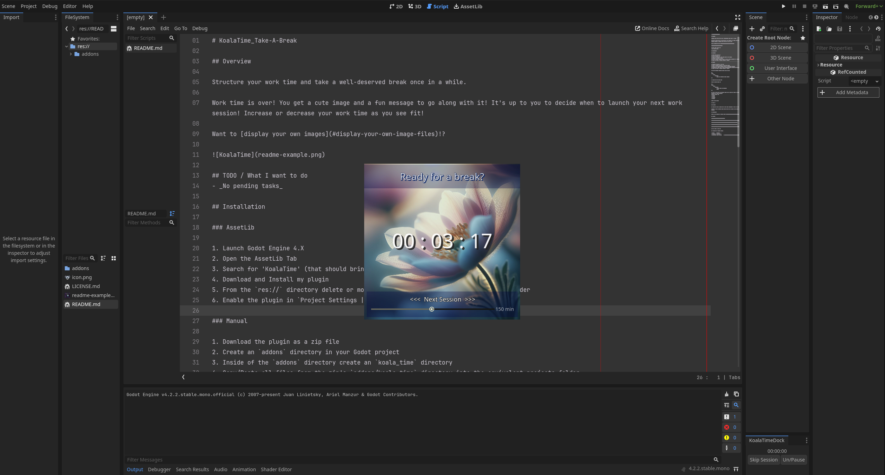
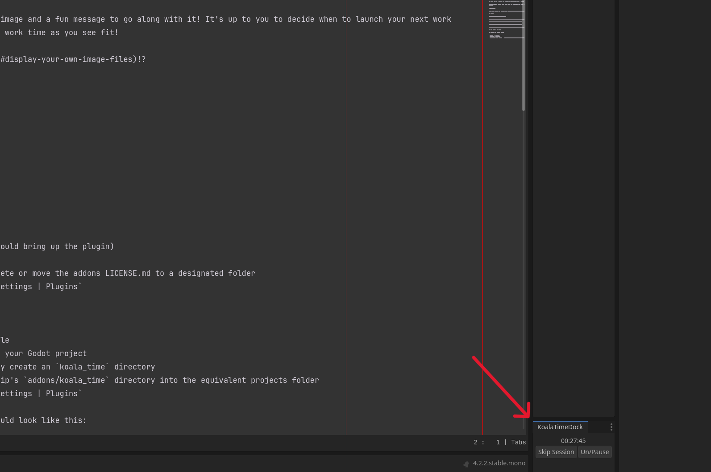
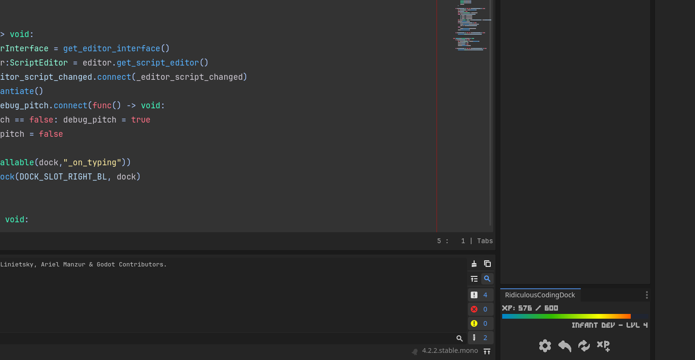
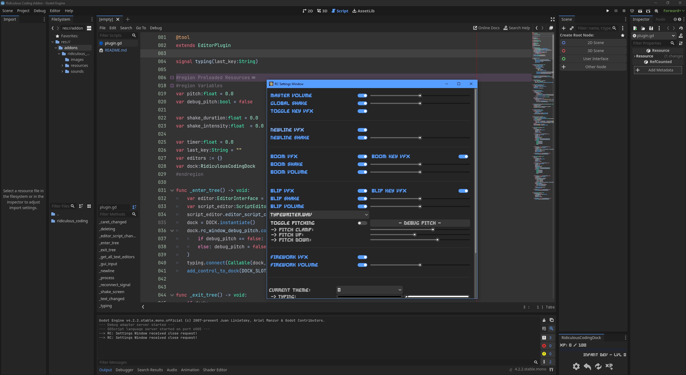
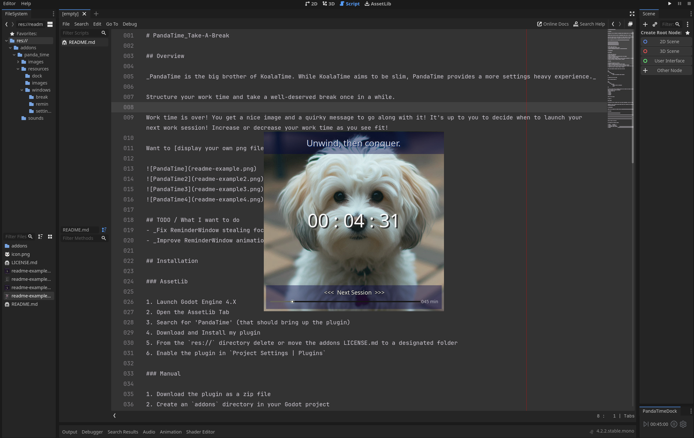
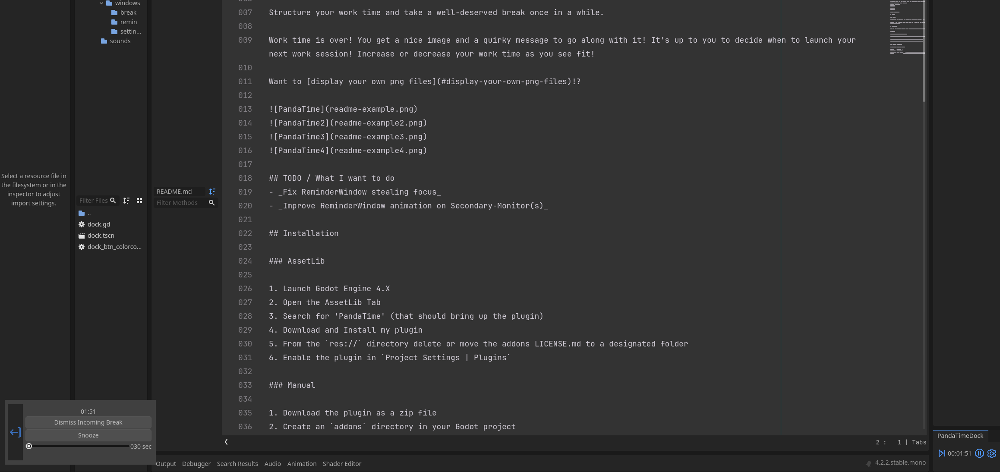
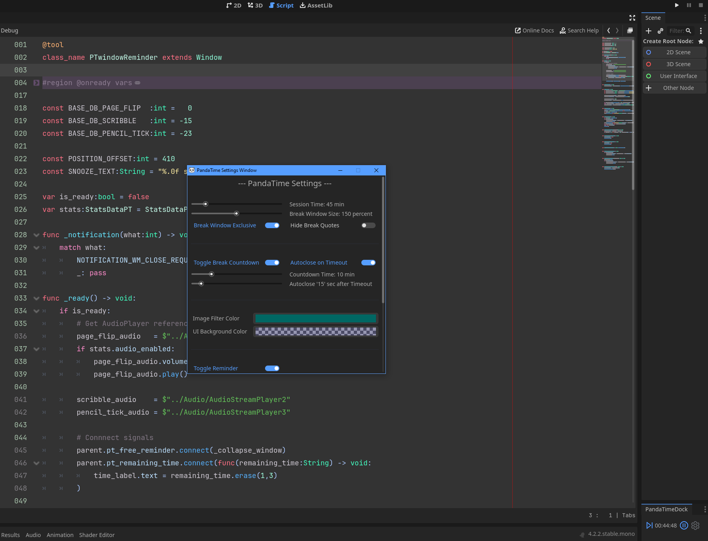
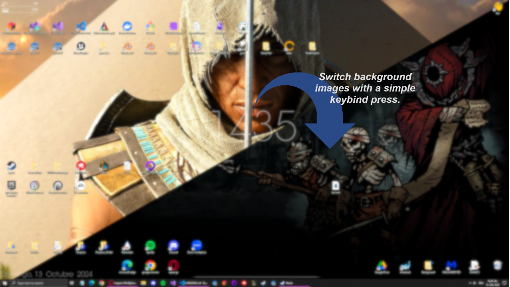

# Cuppixx.github.io - Portfolio
__My personal blog and portfolio__. Last Updated on: October 13th 2024.

- __Name:__ David (Alias: Cuppixx)
- __Bio:__ Hobbyist game developer and IT/software student
- __Contact Information:__ _cuppixd@gmx.de_
- __Location:__ Germany

---

## Table of contents
1. [Introduction](#introduction)
2. [Projects](#projects)
3. [Appendix](#appendix)

## Table of projects
1. [KoalaTime_Take-A-Break](#koala_time)
2. [RidiculousCodingCuppixxVersion](#ridiculous_coding)
3. [PandaTime_Take-A-Break](#panda_time)
4. [WinBgSwitcher](#win_bg_switcher)
   
---

## Introduction and Overview
Hi, I'm Cuppixx, a passionate hobbyist game developer and IT/software student with a focus on computer graphics, game design, development, and software engineering. 

My expertise spans across multiple languages, including  GDScript, Rust, C#, C++, C, Java, Python, SQL, HTML, JavaScript, and more. I have hands-on experience with game engines such as Godot, Unreal, Unity, and Bevy.
I also have foundational knowledge in the fields of networking, internet applications, distributed systems, and IT security.

I love turning ideas into interactive, polished experiences and enjoy working in environments that challenge my creativity and problem-solving skills.

# Projects
Below is a list of projects I have worked on, either independently or as part of a team. These projects include assets, games, software, and templates.
The projects are not listed in any particular order.
 
[//]: # (////////////////////////////////////////////////////////////////////////////////////////////////////////////////////////////////////////////////////////////////////////////////////////////////////////////////////////////////////////////////////////////////////////////////////////////////)
[//]: # (////////////////////////////////////////////////////////////////////////////////////////////////////////////////////////////////////////////////////////////////////////////////////////////////////////////////////////////////////////////////////////////////////////////////////////////////)

## Project: KoalaTime_Take-A-Break
**Project Type:** _Personal, Professional_

**Project Category:** _Engine Asset_

**Role:** _Solo developer_

**Date:** _March 14th 2024 - May 19th 2024_

**Technologies Used:**  `Godot Engine`, `GDScript`

##### Overview

_KoalaTime is an asset I originally developed for personal use and later published to the Godot Asset Store. The asset allows users to set up a work/break timer that reminds them to take a break after a specified period. My goal was to improve my workflow by incorporating small breaks to recharge during work sessions. The project was purposefully kept minimalistic to maintain simplicity and a visually clean design. The asset includes sounds, images, and a few customization options, such as displaying your own images during break time._

##### Key Contributions

- _Solo development._

##### Challenges & Solutions

- _None._

The project itself wasn't what I would consider difficult; there were no challenges that caused me to get stuck during development. However, a few notable features, while not challenging, were interesting to implement. One of these was a recursive algorithm that searches through the project’s file structure to collect any images the user has provided, allowing for a highly flexible file structure. No matter how complex or nested, it will return every image.

##### Results & Impact

- _As of October 2024, the project has received a total of 3 stars on GitHub._
- _Throughout its development the project has had over 300 unique visitors, according to GitHub's traffic tool._
- _After the last commit, the project had an averaged 1 to 2 unique visitors every two weeks, again based on data from GitHub's traffic tool._
- _Feedback from various Twitch users in the Software and Game Development category has been positive. They noted that the plugin looks visually clean and professional. The overall concept was well received, and several streamers mentioned they enjoy using it._

##### Links

- [Project Repository](https://github.com/Cuppixx/KoalaTime_Take-A-Break)
- [Godot Asset Store](https://godotengine.org/asset-library/asset?user=CuppiXD)
  
---
---

[//]: # (////////////////////////////////////////////////////////////////////////////////////////////////////////////////////////////////////////////////////////////////////////////////////////////////////////////////////////////////////////////////////////////////////////////////////////////////)
[//]: # (////////////////////////////////////////////////////////////////////////////////////////////////////////////////////////////////////////////////////////////////////////////////////////////////////////////////////////////////////////////////////////////////////////////////////////////////)

## Project: RidiculousCodingCuppixxVersion
**Project Type:** _Personal, Professional_

**Project Category:** _Engine Asset_

**Role:** _Solo developer_

**Date:** _February 26th 2024 - October 2024_

**Technologies Used:**  `Godot Engine`, `GDScript`

##### Overview

_Ridiculous Coding is an asset I forked to expand upon. It adds flashy and ridiculous visual effects, as well as an XP system, to the Godot engine. The asset is designed to make the coding process more engaging and fun, offering numerous customization options to allow users to adjust the level of ridiculousness to suit their preferences._

##### Key Contributions

- _Solo development on my fork._
- _I fixed a few known issues, such as the state of buttons not being loaded on startup._
- _I developed and added an extensive settings menu._
- _I added new features and settings based on user requests._

Overall, all my contributions were aimed at transforming the asset into my own version, allowing as many users as possible to use the addon and toggle various settings to tailor the plugin to their preferences. Feedback on the original plugin indicated that some users were reluctant to use it due to specific settings, implementations, visuals, or sounds they didn't like. As a result, I reworked and recreated the asset. 

This project was also my very first Godot asset. but thanks to the documentation and a quick understanding of how Godot assets work, it provided an easy and smooth introduction to Godot's asset development.

##### Challenges & Solutions

- _Since I used an existing asset for my first Godot asset, I had to work through a lot of the pre-written code and logic to understand the structure of the original project. This was necessary to effectively implement my own logic into the code flow._
   - _Thanks to the clean code of the original asset, I was able to follow the entire workflow from the code's entry point, which allowed me to understand the project's code as a whole. Still, working on such a "large" project was definitely challenging at the time._ 
- _Midway through development, a problem arose with the settings window, where a few users reported that it was being cut off. This issue seemed unique to certain users, but there was no clear, overlapping context that could have caused it for those specific individuals._
   - _After some research by me and a Twitch streamer, we were able to confirm that the issue was caused by the Godot engine itself. As a result, the issue wasn't pursued further._

##### Results & Impact

- _As of October 2024, the project has 13 stars, making it the most popular fork of the original asset._
- _Throughout its development the project has had over 2000 unique visitors, according to GitHub's traffic tool._
- _After the last commit, the project had an averaged of 5 unique visitors every two weeks, again based on data from GitHub's traffic tool._
- _Feedback from Twitch users in the Software and Game Development category has been positive. They noted that the plugin looks visually clean and professional._
- _Users were pleased with the extensive customization options available and, after some dialogue, recommended features they would love to see in the asset. Many of these features were later implemented, and the additions were well received and appreciated._

##### Links

- [Project Repository](https://github.com/Cuppixx/RidiculousCodingCuppixxVersion)
- [Godot Asset Store](https://godotengine.org/asset-library/asset?user=CuppiXD)
  
---
---

[//]: # (////////////////////////////////////////////////////////////////////////////////////////////////////////////////////////////////////////////////////////////////////////////////////////////////////////////////////////////////////////////////////////////////////////////////////////////////)
[//]: # (////////////////////////////////////////////////////////////////////////////////////////////////////////////////////////////////////////////////////////////////////////////////////////////////////////////////////////////////////////////////////////////////////////////////////////////////)

## Project: PandaTime_Take-A-Break
**Project Type:** _Personal, Professional_

**Project Category:** _Engine Asset_

**Role:** _Solo developer_

**Date:** _March 14th 2024 - August 4th 2024_

**Technologies Used:**  `Godot Engine`, `GDScript`

##### Overview

_PandaTime is an asset I originally developed for personal use and later published to the Godot Asset Store. The asset allows users to set up a work/break timer that reminds them to take a break after a specified period. My goal was to improve my workflow by incorporating small breaks to recharge during work sessions. The project was designed with a visually clean design in mind and features a dedicated settings window. The asset includes sounds, images, and a lot of customization options._

_The asset is a more feature and settings heavy version of the above KoalaTime._

##### Key Contributions

- _Solo development._

##### Challenges & Solutions

- _Communication between various isolated, separate window instances._
  - _Solved by setting up a signal connection during instantiation, before adding the instance to the scene tree. I also connected to the window's internal signals from the outside to obtain information about the window state, using those informations to exchange data before a node is freed from the scene tree._

##### Results & Impact

- _As of October 2024, the project has no stars on GitHub._
- _Throughout its development the project has had over 150 unique visitors, according to GitHub's traffic tool._
- _After the last commit, the project had an averaged 0 to 1 unique visitors every two weeks, again based on data from GitHub's traffic tool._
- _Feedback from 2 Twitch users in the Software and Game Development category has been positive. They noted that the plugin looks visually clean and professional. The overall concept was well received._
- _Users were pleased with the extensive customization options available and had no further requests for feature implementation._

##### Links

- [Project Repository](https://github.com/Cuppixx/PandaTime_Take-A-Break)
- [Godot Asset Store](https://godotengine.org/asset-library/asset?user=CuppiXD)
  
---
---

[//]: # (////////////////////////////////////////////////////////////////////////////////////////////////////////////////////////////////////////////////////////////////////////////////////////////////////////////////////////////////////////////////////////////////////////////////////////////////)
[//]: # (////////////////////////////////////////////////////////////////////////////////////////////////////////////////////////////////////////////////////////////////////////////////////////////////////////////////////////////////////////////////////////////////////////////////////////////////)

## Project: WinBgSwitcher
**Project Type:** _Personal, Professional_

**Project Category:** _Software_

**Role:** _Solo developer_

**Date:** _October 9th 2024 - October 13th 2024_

**Technologies Used:**  `Python`

##### Overview

_The WindowsBackgroundSwitcher is a small program I designed in a few hours time to run in the background of my PC. It allows for users to switch the desktop background image with the press of a keybind. It uses two folders to swap between images and can run on startup for ease of use.
The executable works with a config.ini file, which allows you to set the two folders and customize the keybinds to your liking._

_I designed the application to quickly swap my desktop images for ones I don’t mind sharing during screen shares on Discord, Zoom, or some other tools for my studies._

##### Key Contributions

- _Solo development._

##### Challenges & Solutions

- _Communication between the Python application and the Windows operating system._
  - _Since this was my first time writing an application focused on communication with the operating system, I chose Python for this project because its packages facilitate smooth interaction with the OS._

##### Results & Impact

- **_Add in once the project has been out long enough!_**

##### Links

- [Project Repository](https://github.com/Cuppixx/WinBgSwitcher)
- [Itch.io](https://cuppixx.itch.io/win-bg-switcher)
  
---
---

[//]: # (////////////////////////////////////////////////////////////////////////////////////////////////////////////////////////////////////////////////////////////////////////////////////////////////////////////////////////////////////////////////////////////////////////////////////////////////)
[//]: # (////////////////////////////////////////////////////////////////////////////////////////////////////////////////////////////////////////////////////////////////////////////////////////////////////////////////////////////////////////////////////////////////////////////////////////////////)

# Appendix

## Portfolio Project Template
**Project Type:** _Personal, Academic, Professional, etc._

**Project Category:** _Asset, Game, Software, Template, etc._

**Role:** _Solo developer, Team lead, Game designer, Programmer, etc._

**Date:** _Start Date - End Date_

**Technologies Used:**  `Language/Framework/Tool 1`, `Language/Framework/Tool 2`, `Language/Framework/Tool 3`

##### Overview

_A brief description of the project (2-3 sentences), highlighting the purpose, goals, and key features._

##### Key Contributions

- _List specific tasks or roles you had within the project._
- _Highlight what you personally added or developed._
- _Focus on measurable outcomes or key functionality you delivered._

##### Challenges & Solutions

- _Describe any major technical challenges you faced._
- _Mention the solutions or approaches you implemented to overcome them._

##### Results & Impact

- _Quantify the success of the project (e.g., user engagement, performance improvements, etc.)._
- _Mention any relevant feedback, metrics, or achievements tied to this project._

##### Links

- [Project Repository](#)
- [Live Demo / Website](#)
- [Video / Showcase](#)
  
---
---

[//]: # (////////////////////////////////////////////////////////////////////////////////////////////////////////////////////////////////////////////////////////////////////////////////////////////////////////////////////////////////////////////////////////////////////////////////////////////////)
[//]: # (////////////////////////////////////////////////////////////////////////////////////////////////////////////////////////////////////////////////////////////////////////////////////////////////////////////////////////////////////////////////////////////////////////////////////////////////)
